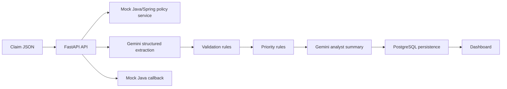

# AI Claims Intake Copilot v2

FastAPI + Gemini structured output + PostgreSQL + mock Java/Spring integration + Streamlit dashboard.

## What changed in v2
- Mock integration with a Java/Spring Boot core service
- PostgreSQL persistence for processed claims
- Minimal Streamlit dashboard for demo
- Docker Compose to run the whole stack
- Gemini structured output updated to use `response_json_schema`

## Architecture



## Services
- `api`: FastAPI claims intake pipeline
- `db`: PostgreSQL persistence
- `mock-java`: Spring Boot mock service with policy lookup and intake callback
- `dashboard`: Streamlit dashboard

## Environment
Copy `.env.example` to `.env` and set your Gemini key.

```bash
cp .env.example .env
```

Required:
```env
GEMINI_API_KEY=your_real_key_here
```

## Run with Docker Compose
```bash
docker compose up --build
```

Endpoints:
- API: `http://localhost:8000`
- Dashboard: `http://localhost:8501`
- Mock Java: `http://localhost:8081`

## Main API routes
- `GET /health`
- `POST /api/v1/claims/intake`
- `POST /api/v1/claims/extract`
- `POST /api/v1/claims/validate`
- `POST /api/v1/claims/priority`
- `POST /api/v1/claims/summarize`
- `GET /api/v1/claims/recent`
- `GET /api/v1/claims/{claim_id}`
- `GET /api/v1/claims/dashboard/summary`
- `GET /api/v1/claims/samples`
- `GET /api/v1/claims/samples/{sample_name}`
- `POST /api/v1/claims/samples/{sample_name}/run`

## Local dev without Docker
1. Start PostgreSQL locally or switch `DATABASE_URL` to SQLite for quick tests.
2. Install dependencies:
```bash
pip install -r requirements.txt
```
3. Run API:
```bash
uvicorn app.main:app --reload
```

## Demo flow
1. Open the dashboard
2. Process one of the synthetic claim samples
3. Review the persisted result in the table
4. Open the claim detail
5. Show the policy enrichment from the Java mock
6. Highlight the persisted priority and analyst summary

## Notes
- The dataset is synthetic.
- The Java service is a mock meant to emulate an Acsel-like enterprise core.
- The dashboard is intentionally minimal and optimized for demo value.
